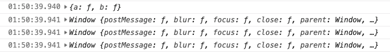
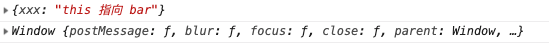
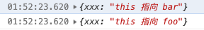
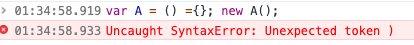
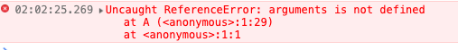

# ES6 之箭头函数

随着前端最近几年的快速发展，前端语言也带来翻天覆地的变化，沉寂多年的 JavaScript 也迎来大变革，许多新特性加入到了 JavaScript 语言当中。今天我们就来聊聊 ES6 带来的一个新特性 —— 箭头函数。

## 什么是箭头函数

箭头函数是 ES6 引入的新特性。相对于普通函数，箭头函数的写法非常简单，同时箭头函数还有很多与普通函数不同的特点。在下面的篇幅中，我会详细介绍这些特点。

## 箭头函数的特点

前面我们讲了箭头函数是 ES6 引入的新特性，那么它到底与普通函数有什么区别呢？在使用箭头函数时，我们需要注意些什么呢？

《**ES 6标准入门**》(**第二版**)中有这样四个注意点：

::: quote

1. **函数体内的`this`对象就是定义时所在的对象，而不是使用时所在的对象。**
2. **不可以当做构造函数。也就是说，不可以使用`new`命令，否则会抛出一个错误。**
3. **不可以使用`arguments`对象，该对象在函数体内不存在。如果要用，可以使用rest参数代替。**
4. **不可以使用`yield`命令，因此箭头函数不能用作`Generator`函数。**

:::

这本书简单概括了箭头函数的特点，但是我觉得还不够详细。下面我就来将每一个特点展开讲解，并配合代码示例，希望能帮助大家更好地理解箭头函数。

## 更简单的语法

相对于普通的函数，箭头函数的语法更加的简单。下面我们来举几个例子。

```javascript
// 普通函数声明
var func1 = function() {}
// 箭头函数声明
var func1 = () => {}

// 普通函数带一个参数
var func2 = function(arg0) {}
// 箭头函数带一个参数
var func2 = arg0 => {}

// 普通函数带多个参数
var func3 = function(arg0, arg1) {}
// 箭头函数带多个参数
var func3 = (arg0, arg1) => {}

// 普通函数返回值
var func4 = function() { return '返回值' }
// 箭头函数返回值
var func4 = () => '返回值'

// 普通函数多条语句
var func5 = function() {
  var a = '一条语句'
  return a
}
// 箭头函数多条语句
var func5 = () => {
  var a = '一条语句'
  return a
}
```

怎么样，是不是感觉箭头函数更加的简单明了。我们不仅写起来方便快捷，还增加了代码的可读性。简洁的语法使它受到了许多开发者的喜爱。目前在我经历的项目中，能用箭头函数的，绝不会使用普通函数。尤其是在回调函数的时候，我会优先考虑使用箭头函数代替普通函数，当然这不仅仅因为它的简洁性，还有一个非常重要的特性让我选择使用它，那就是箭头函数的`this`指向。

## this 指向问题

箭头函数的`this`指向规则和普通函数有很大的区别。这里我用代码来解释下箭头函数的`this`指向问题，请看下面的代码。

```javascript
var obj ={
  a: function() {
    console.log(this)
  },
  b: () => {
    console.log(this)
  }
}

// { a: ..., b: ... } 返回obj对象
obj.a()
// Window{...} 返回window对象
obj.b()

var a = obj.a
// Window{...} 返回window对象
a()

var b = obj.b
// Window{...} 返回window对象
b()
```



我们可以看到，我同样在`obj`对象中定义了属性方法，并且使用同样的方式执行它们，但是结果却不一样。这是为什么呢？

刚接触不久的前端同学应该深有感触，在 JavaScript 语言中，`this`是个淘气的孩子，总喜欢调皮捣蛋，有时候你看着外套都一样，可以一叫才发现已经换了一个人儿。所以使用`this`时，我们总是非常谨慎，深怕一不注意就出错了。但是在箭头函数中不会出现这样的问题。原因是普通函数是在使用时才能确定`this`的指向（即`this`是调用这个函数的对象，如果在全局调用，那调用的对象就是`window`或者`undefined`，这与是否是严格模式有关），而箭头函数的`this`是在定义时就已经确定了。

### 箭头函数本身没有`prototype`（原型）对象，所以箭头函数本身是没有`this`的。

```javascript
var a = () => {}
console.log(a.prototype) // undefined
```


### 箭头函数的`this`指向在定义时就继承了外层第一个普通函数的`this`。

请看下面这段代码，它能更好地让我们理解这条规则。

```javascript
var a, b;
var bar = { xxx: 'this 指向 bar' }
var foo = { xxx: 'this 指向 foo' }

function barFn() {
  // 我们在 barFn 函数中定义了箭头函数 a
  a = () => console.log(this)
  // 我们在 barFn 函数中定义了普通函数 b
  b = function() { console.log(this) }
}

function fooFn() {
  // 我们在 fooFn 函数中调用函数 a
  a()
  // 我们在 fooFn 函数中调用函数 b
  b()
}

// 我们修改 barFn 的 `this` 指向
barFn.call(bar)
// 我们修改 fooFn 的 `this` 指向
fooFn.call(foo)
```



这个例子我们可以得出两个结论：

1. 箭头函数的`this`指向定义时所在的第一个外层函数，跟使用的位置无关。
2. 当被继承的外层函数的`this`发生改变时，箭头函数的`this`也会跟着改变。

### 我们不能直接修改箭头函数的this指向

下面我们对上面的fooFn函数做一些修改

```javascript
function fooFn() {
  a.call(this)
  b.call(this)
}
```



这里我们可以看到即使我们手动修改了`this`的指向，也不会影响到箭头函数的`this`指向。

::: warning
使用`bind`、`apply`、`call`无法改变箭头函数的`this`指向，但是仍然可以将实参传入箭头函数。当然箭头函数的`this`并非完全不可修改，我们可以修改被继承的外层函数的`this`来间接地修改箭头函数的`this`指向。这个在上一个例子中有所体现。
:::

### 箭头函数外层没有普通函数包裹时，无论是否在严格模式下，this 都会指向 window 对象。

之前我们说了 “箭头函数的`this`指向第一个外层函数的`this`” 这句话确实没错。但是仔细想想，如果箭头函数外层没有函数时它又指向哪里呢？

我们知道普通函数在非严格模式下`this`是指向`window`的，而在严格模式下`this`是`undefined`。但是箭头函数的规则不同，无论是否在严格模式下，`this`都会指向`window`。

以上就是箭头函数中，`this`的特点。正是这些特点，我们在回调函数和多层嵌套的函数中经常会使用它，尤其是函数内正好需要使用外层函数的`this`时。这使我们不需要专门定义一个变量来保存`this`，增强了代码的可读性。

## 不能将箭头函数作为构造函数使用

```javascript
var A = () => {}
new A()
```



上图我们可以看到，我们使用箭头函数`new`了一个实例，结果却报了语法错误。

```javascript
function A() {
  this.arrow = () => {
    super()
  }
}

var a = new A()

a.arrow()
```


上面的执行结果，当箭头函数中执行`super`时报错了，因为箭头函数不是构造函数，函数体中没有`super`函数。

```javascript
function A() {
  this.arrow = () => {
    console.log(new.target)
  }
}

var a = new A()

a.arrow()
```


```javascript
function A() {
  
}

A.prototype.b = function() {
  this.arrow = () => {
    console.log(new.target)
  }
}

var a = new A()

a.b()
a.arrow()
```


从上面两个例子中，我们可以看出，`new.target`的值是不一样的，这也证明了箭头函数不能作为构造函数。

## 箭头函数没有 arguments 对象

```javascript
var a = () => { console.log(arguments) }
a(1, 2)
```



这里可以看到，当在箭头函数中调用`arguments`会出现报错的情况。但是你以为这样就完了吗？通过图片我们可以看到错误信息是指引用错误`ReferenceError`。那么，如果我们在`this`对象上定义一个`arguments`参数会怎么样呢？我们试试吧。

```javascript
window.arguments = ['a', 'b']
var a = () => { console.log(arguments) }
a(1, 2)
```


没错，正如我们所想。`arguments`返回的是我们全局定义的属性的值。

到这里我们可以看到，箭头函数的函数体中并不存在`arguments`对象。我们知道`arguments`方便了我们获取函数的参数，在箭头函数中，是否可以有一种方式能获取函数的所有参数呢？答案当然是肯定的，而且比`arguments`的功能更加的强大。这就不得不讲到的另一个 ES 6 引入的特性——`rest参数`。而且`rest参数`返回的是一个真正的数组（`arguments`返回的是一个类数组，不能调用数组的一些方法，需要手动做一次转义）。对于`rest参数`，我这里就不细讲了，感兴趣的同学可以自己去查阅资料，内容也不复杂，非常容易理解，使用也非常方便。

```javascript
var a = (...rest) => console.log(rest)
a(1, 3, 5)
```


## 箭头函数不能使用 yield 命令

```javascript
var a = num => {
  var b = yield num + 1
  return b
}
```


```javascript
var a = *(num) => {
  var b = yield num + 1;
  return b;
}
```


首先，箭头函数没有`function`关键字，所以实际是不能写成 Generator 函数，这样`yield`自然也是没有用了。

## 总结

1. 箭头函数提供了更加简单地创造函数的方案。
2. 箭头函数的`this`在定义时确定作用域，普通函数在执行时确定作用域。
3. 改变箭头函数的第一层普通函数的`this`指向可以修改箭头函数的`this`。
4. 如果箭头函数没有普通函数包裹，那`this`永远指向`window`对象。
5. 箭头函数不能成为构造函数。
6. 箭头函数体没有包含`arguments`、`super`、`new.target`、`this`。
7. `bind`、`call`、`apply`无法改变箭头函数的`this`指向，但是能传入实参。
8. 箭头函数不能成为 Generator 函数，所以不能使用`yield`命令。
