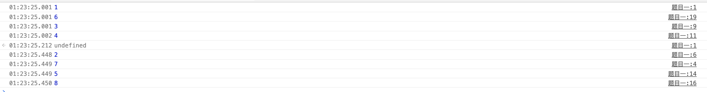

# 探索JavaScript运行机制

从事前端工作的同学大部分都接触过JavaScript。我们在执行JavaScript脚本时，经常会用到setTimeout、Promise等前端异步技术，那么你们有没有考虑过JavaScript到底是怎样运行的呢？同样是异步技术，他们之间又有什么区别呢？在执行过程中，我们怎么确定哪个异步先执行，哪个异步后执行呢？今天，就让我们一起带着这些疑问来探究下前端开发中的异步技术和JavaScript的运行机制。

JavaScript实现异步的方式有很多种，但是归根结底可以将它们划分为两大类 —— 宏任务和微任务。

## 宏任务

宏任务是存放在宏任务队列中的任务。在一轮任务周期中，宏任务队列只推出一个任务执行。

- script引入的脚本
- setTimeout
- setInterval
- setImmediate
- I/O
- UI Rendering

## 微任务

微任务是存放在微任务队列中的任务。在一轮任务周期中，微任务队列会依次推出任务执行，直到微任务队列中没有任务为止（即一轮任务周期完成）。

- 原生Promise（部分第三方实现的Promise会被放入宏任务队列中）
- Object.observe（已废弃）
- MutationObserver
- MessageChannel

## 宏任务与微任务的区别

浏览器在执行脚本的过程中，会把不同的任务放入不同的队列当中去。当执行的时候，浏览器首先会从宏任务队列中推出一个任务并执行。当执行完当前的宏任务之后，浏览器会从微任务队列中逐个运行所有的任务。我把这个称为一个任务周期，循环往复，浏览器会执行很多个这样的任务周期。

通俗点讲，就像你去银行办理业务，因为处理业务的人比较多，你就需要取号排队，这个就是**宏任务队列**。终于轮到你了，你跟柜台说你需要办理存款业务，柜台帮你办理了；你又说，你要办理理财业务，柜台又帮你办理了，就这样，你可以一次性办理完所有你想要办理的业务而不需要重新排队，这就是**微任务队列**。

从上面的例子，我们可以看到宏任务每次都只能执行一个任务，微任务会把当前队列中的所有任务都执行完成后再处理下一个宏任务。

## 举个栗子

说了这么多，我们不如直接来看栗子，加深我们的印象。

```javascript
console.log(1)

setTimeout(() => {
    Promise.resolve(7).then(r => console.log(r))

    console.log(2)
})

Promise.resolve(3).then(r => console.log(r))

Promise.resolve(4).then(r => console.log(r))

setTimeout(() => {
    console.log(5)

    Promise.resolve(8).then(r => console.log(r))
})

console.log(6)
```

上面是一个观察浏览器宏任务和微任务的列子，你们觉得执行结果会是什么呢？



跟你想的一样吗？下面我来讲解下这段代码的执行过程吧！

1. script标签引入的脚本是第一个宏任务，所以先执行。
2. 第一行代码是同步代码，所以直接执行并打印结果 `1`。
3. 第三行代码遇到了setTimeout，setTimeout是宏任务，所以推入宏任务队列中，等待执行。
4. 第九行代码遇到了Promise，Promise是微任务，所以推入微任务队列中，等待执行。
5. 第十一行代码又遇到了Promise，推入微任务队列中，等待执行。
6. 第十三行代码又遇到了setTimeout，推入宏任务队列中，等待执行。
7. 第十九行代码是同步代码，直接执行并打印结果`6`。

第一个宏任务执行结束了，现在宏任务队列中有两个任务，微任务队列中也有两个任务。下面浏览器会执行刚刚推入微任务队列中的所有任务。

1. 第一个微任务是第九行代码创建的，执行并打印结果`3`。
2. 第二个微任务是第十一行代码创建的，执行并打印结果`4`。

就这样一个任务周期就结束了。我前面说过，现在宏任务中还有两个任务，所以我们继续下一个任务周期。

**执行宏任务**

1. 执行第一个setTimeout中的回调函数。
2. 遇到Promise，推入微任务队列，等待执行。
3. 遇到同步代码，直接执行并打印结果`2`。

执行微任务

1. 执行Promise的then方法，直接执行并打印结果`7`。

**执行宏任务**

1. 执行第二个setTimeout中的回调函数。
2. 遇到同步代码，直接执行并打印结果`5`。
3. 遇到Promise，推入微任务队列，等待执行。

**执行微任务**

1. 执行Promise的then方法，直接执行并打印结果`8`

好了，执行结束，这就是所有异步任务的执行顺序。讲解之后是不是很清晰！

## 参考

- [微任务、宏任务与Event-Loop](https://juejin.im/post/5b73d7a6518825610072b42b)
