# Vue源码解析之依赖收集和派发更新

相信大家都知道，如今的前端开发主要是使用最流行的三大框架Angular、React、Vue。尤其React无论在国内还是国外都深受前端开发者的喜爱，市场占有率可以说是相当的高。另外两大框架也是不甘落后，因其各自的特点，牢牢把握住了一部分忠实的粉丝。今天我们要说的是三大框架之中的Vue框架。

Vue由于其渐进式的开发方式、完善的脚手架工具以及简单易懂的开发文档，深受一部分国人的喜爱。使用过Vue的都知道，在我们修改`data`中某个数据的时候，相关依赖的`watch`、`computed`、`renderer`都会随之更新，那Vue是如何做到的呢？今天我们就来讲讲Vue在这块的实现方式——响应式数据更新。

关于这个黑科技般的动作在Vue的实现方式中，我们有两个专有的名词（**依赖收集**和**派发更新**）。

Vue在实现响应式数据时，利用的是原生JavaScript的一个方法`Object.defineProperty`。这个方法可以重写对象属性的`get`和`set`方法，使我们保证原来的行为不变的同时，添加额外的行为。Vue就是利用对象属性的`get`来实现**收集依赖**，利用对象属性的`set`来实现**派发更新**。

::: tip
本文主要讲解的是Vue响应式数据设计的思想，对于具体代码及具体的实现方案不会有特别详细的讲解。尤其涉及到与`Object.defineProperty`有关的`proxy`（用于响应式数据的代理，主要是方便开发者的操作）、`defineReactive`（响应式数据的核心方法，响应式数据属性的`get`和`set`实现部分都在这个方法中实现）、`observe`（主要用于创建响应式对象，所有响应式对象都能在属性中找到`__ob__`属性）、`defineComputed`（主要用于处理`computed`属性）有关的实现方式，这里不会具体说明。关于这些细则，你可以浏览网上一些讲源码的文章或者可以自行查阅源码。
:::

## 响应式数据的三个重要类

在说**依赖收集**和**派发更新**之前，我们先说说跟这两个动作强相关的三个类。Vue内部定义了三个类`Observer`、`Dep`、`Watcher`。

- `Observer`是用来管理响应式对象的，主要是将一个不同对象封装成一个响应式对象。（比如：Vue中的`data`以及`data`下的`Object`或者`Array`类型的属性）
- `Dep`是一个依赖类，每个响应式对象属性都会创建一个对应的依赖类实例，`get`操作会收集相关的`watcher`，而`set`操作会通知收集的`watcher`更新。（比如：`data`的属性以及`data`下的`Object`或者`Array`数据的属性）
- `Watcher`的作用则是为视图或者数据创建一个监听，响应式数据发生改变的时候，就是通过它来通知相应的视图或者数据更新。（比如：`视图Watcher`、`computed watcher`、`user watcher`等）

## 依赖收集

前面我们介绍了，`data`的每一个属性都会与一个`dep`实例绑定。从上图可知，当我们更新视图或者`computed`时，会触发依赖数据的`get`动作。`get`动作会触发其`dep`实例的`depend`方法，从而收集到当前操作它的`watcher`，这个过程就叫做**依赖收集**。

举个栗子，比如上图中的`data`有一个属性`message`，当视图需要展示`message`的值或者`computed`需要依赖`message`获取具体的值时，`message`的`get`动作就会被触发。这时候，当前的视图`Watcher`就会被添加到message的依赖项中等待后续可能发生的操作。

## 派发更新

**派发更新**的动作也很简单，当`data`的某个属性发生改变时，对应这个属性的`dep`实例就会执行`notify`方法，与之依赖的`watcher`会被通知进入异步队列中等待执行，等到主线程上的任务执行完成后，异步队列就会执行这些`watcher`。如果是视图`watcher`，就会重新渲染页面中相关组件的**DOM**。如果是`computed watcher`，就会将`computed`属性设置为`dirty`，在下次读取`computed`属性时更新数据。这个过程就是**派发更新**。

举个栗子，比如上图中的`data`有一个属性`message`，当`message`的改变时，就会触发`set`动作。这时候，与其关联的视图`watcher`就会执行`update`操作，重新渲染DOM元素；与其相关的`computed watcher`就会将`dirty`置为`true`，等待下一次读取时更新值。

## 总结

好了，以上讲述的就是Vue响应式数据的设计思路。

`Observer`类的作用就是将对象置为响应式对象，使对象的属性能在`get`或者`set`时执行响应式动作。

`Dep`类的作用就是在响应式对象的属性被读取时，收集所有依赖这个属性的`watcher`；在响应式对象的属性改变时，通知所有依赖的`watcher`更新。

`watcher`类起到一个监听器的作用，在更新阶段能将正确的值反馈给相应的属性或者视图，以及执行相关的回调函数，保证数据与数据之间、数据与视图之间的同步性。
