title: Vue源码解析之响应式数据设计
speaker: sky
prismTheme: okaidia

<slide class="bg-apple aligncenter" image=".dark">

# Vue源码解析之响应式数据设计 {.text-landing.text-shadow}

<hr>

By sky {.text-intro}

<slide class="bg-apple aligncenter" image=".dark">

# 响应式数据设计三问

:::{.content-center}

<hr>

- Vue data是怎么完成依赖收集和派发更新的？
- Vue computed是怎么根据依赖数据的变化及时更新的？
- Vue watch是如何监听数据变化的？

:::

<slide class="bg-apple aligncenter" image=".dark">

# Vue响应式设计最重要的三个函数和三个类

<hr>

:::{.content-left}

```javascript
proxy()

observe()

defineReactive()
```

:::

:::{.content-right}

```javascript
class Observer{}

class Dep{}

class Watcher{}
```

:::

<slide class="bg-apple aligncenter" image=".dark">

# 三个重要函数

<slide class="bg-apple aligncenter" image=".dark">

# proxy

<hr>

:::{.content-left}

proxy有三个参数，分别是 `target: Object`、`sourceKey: string`、`key: string`

主要作用是对Vue实例上的属性的代理，比如我们常写的data、props。

:::

:::{.content-right}

```javascript
function proxy (target: Object, sourceKey: string, key: string) {
  sharedPropertyDefinition.get = function proxyGetter () {
    return this[sourceKey][key]
  }
  sharedPropertyDefinition.set = function proxySetter (val) {
    this[sourceKey][key] = val
  }
  Object.defineProperty(target, key, sharedPropertyDefinition)
}
```

:::

<slide class="bg-apple aligncenter" image=".dark">

# observe

<hr>

:::{.content-left}

observe有两个参数，分别是`value: any`、`asRootData: boolean`

主要作用是给对象添加一个观察者。

:::

:::{.content-right}

```javascript
function observe (value: any, asRootData: ?boolean): Observer | void {
  if (!isObject(value) || value instanceof VNode) {
    return
  }
  let ob: Observer | void
  if (hasOwn(value, '__ob__') && value.__ob__ instanceof Observer) {
    ob = value.__ob__
  } else if (
    shouldObserve &&
    !isServerRendering() &&
    (Array.isArray(value) || isPlainObject(value)) &&
    Object.isExtensible(value) &&
    !value._isVue
  ) {
    ob = new Observer(value)
  }
  if (asRootData && ob) {
    ob.vmCount++
  }
  return ob
}
```

:::

<slide class="bg-apple aligncenter" image=".dark">

# defineReactive

<hr>

:::{.content-left}

defineReactive有五个参数，分别是 `obj: Object`、`key: string`、`val: any`、`customSetter?: ?Function`、`shallow?: boolean`

主要作用是定义一个响应式，用于做数据的依赖收集工作。

:::

:::{.content-right}

```javascript {style="height: 70vh; overflow-y: scroll;"}
function defineReactive (
  obj: Object,
  key: string,
  val: any,
  customSetter?: ?Function,
  shallow?: boolean
) {
  const dep = new Dep()

  const property = Object.getOwnPropertyDescriptor(obj, key)
  if (property && property.configurable === false) {
    return
  }

  // cater for pre-defined getter/setters
  const getter = property && property.get
  const setter = property && property.set
  if ((!getter || setter) && arguments.length === 2) {
    val = obj[key]
  }

  let childOb = !shallow && observe(val)
  Object.defineProperty(obj, key, {
    enumerable: true,
    configurable: true,
    get: function reactiveGetter () {
      const value = getter ? getter.call(obj) : val
      if (Dep.target) {
        dep.depend()
        if (childOb) {
          childOb.dep.depend()
          if (Array.isArray(value)) {
            dependArray(value)
          }
        }
      }
      return value
    },
    set: function reactiveSetter (newVal) {
      const value = getter ? getter.call(obj) : val
      if (newVal === value || (newVal !== newVal && value !== value)) {
        return
      }
      if (process.env.NODE_ENV !== 'production' && customSetter) {
        customSetter()
      }
      // #7981: for accessor properties without setter
      if (getter && !setter) return
      if (setter) {
        setter.call(obj, newVal)
      } else {
        val = newVal
      }
      childOb = !shallow && observe(newVal)
      dep.notify()
    }
  })
}
```

:::

<slide class="bg-apple aligncenter" image=".dark">

# 三个重要类

<slide class="bg-apple aligncenter" image=".dark">

# Observer

<hr>

:::{.content-left}

Observer类的构造函数接收一个参数，即被观察的对象或者数组。

最明显的特征是，被观察的对象中可以看到属性`__ob__`，这是一个不可遍历属性。

:::

:::{.content-right}

```doc
构造函数参数
value: any

构造函数属性
value: any
dep: Dep
vmCount: number

构造函数方法
walk(obj: Object)
observeArray(items: Array<any>)
```

:::

<slide class="bg-apple aligncenter" image=".dark">

# Dep

<hr>

:::{.content-left}

Dep类用于创建一个依赖。

Dep实例对外无法观测到。响应式数据的每一个属性都会对应创造一个依赖。依赖在数据变化更新中起到了非常关键的作用。

:::

:::{.content-right}

```doc
构造函数属性
target: ?Watcher
id: number
subs: Array<Watcher>

构造函数方法
addSub(sub: Watcher)
removeSub(sub: Watcher)
depend()
notify()

```

<slide class="bg-apple aligncenter" image=".dark">

# Watcher

<hr>

:::{.content-left}

Watcher类的构造函数最多可以介绍五个参数。

Watcher实例用于创建一个监听器。用于监听数据的改变，以及数据改变后需要做的事。

:::

:::{.content-right}

```doc
构造函数参数
vm: Component           options?: ?Object
expOrFn: string | Function
cb: Function            isRenderWatcher?: boolean

构造函数属性
vm: Component
expression: string      active: boolean
cb: Function            deps: Array<Dep>
id: number              newDeps: Array<Dep>
deep: boolean           depIds: SimpleSet
user: boolean           newDepIds: SimpleSet
lazy: boolean           before: ?Function
sync: boolean           getter: Function
dirty: boolean          value: any

构造函数方法
get()                   update()           depend()
addDep(dep: Dep)        run()              teardown()
cleanupDeps()           evaluate()
```

<slide class="bg-apple aligncenter" image=".dark">

# data怎么实现响应式

<hr>

{style="height: 75vh;"}

<slide class="bg-apple aligncenter" image=".dark">

# computed怎么实现响应式

<hr>

{style="height: 75vh;"}

<slide class="bg-apple aligncenter" image=".dark">

# watch怎么实现响应式

<hr>

{style="height: 75vh;"}

<!-- <slide class="bg-apple aligncenter" image=".dark"> -->

<!-- # props怎么实现响应式 -->

<!-- <hr> -->
